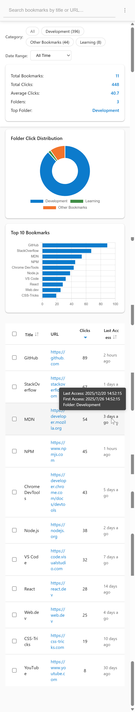
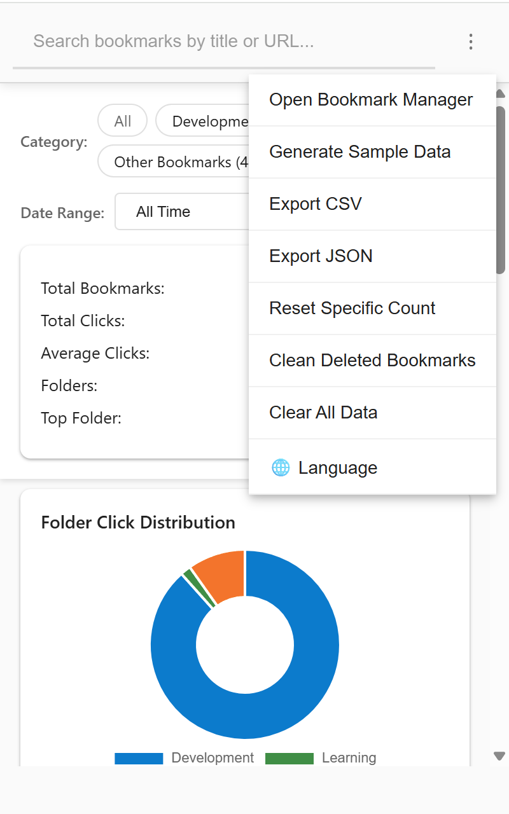

# Bookmark Click Tracker

[English](README.md) | [中文](README_zh.md)

A Chrome extension that tracks how often you use bookmarks.

## Features (Concise)

- Track clicks per bookmark
- Stats: total, average, folders, top folder
- Search by title/URL; filter by folder/date
- Sort by title, clicks, or last access
- Tooltip shows full timestamps
- Export CSV/JSON
- Language switch (English/中文)

## Usage (Concise)

- Click the toolbar icon to open the popup
- Search, filter, and sort to explore stats
- Use the menu (⋮) for export, resets, and language
- Hover “Last Access” to view details

## Preview

