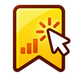
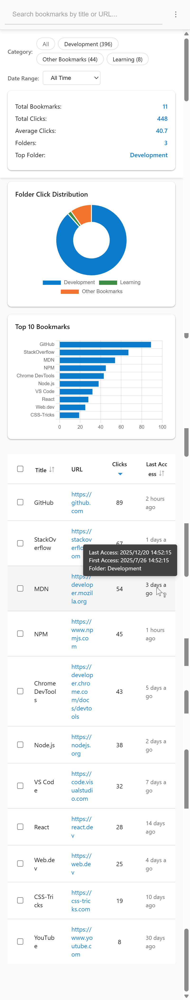
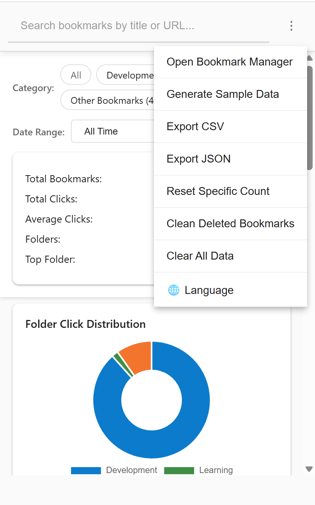

  

# Bookmark Click Tracker

[English](README.md) | [中文](README_zh.md)

Bookmark Click Tracker shows which saved links you actually use, helping you understand and organize a growing bookmark collection.

  

## Features

- Automatically counts visits to saved bookmarks
- Shows total bookmarks, total visits, average visits, folder count, and the most-used folder
- Visualizes folder activity and the top 10 bookmarks
- Searches by bookmark title or URL
- Filters by folder and time range
- Sorts by title, visit count, or last access time
- Shows first and most recent access timestamps
- Exports statistics as CSV or JSON
- Merges statistics when a bookmark URL changes
- Cleans records for deleted bookmarks and resets selected counts
- Switches between English and Chinese

## How to use

1. Click the extension icon in the Chrome toolbar.
2. Browse the overview to see bookmark and folder statistics.
3. Use search, folder filters, date filters, and sorting to find the links you need.
4. Open the menu to export data, merge bookmark records, clean deleted bookmarks, or reset counts.
5. Hover over a **Last Access** value to see full timestamps and folder information.

## Privacy and permissions

Bookmark URLs, visit counts, and access timestamps are processed and stored locally in your browser. The extension does not sell data, run analytics, show ads, or send bookmark data to the developer or other third parties.

Access to bookmarks, browsing history, and page navigation is used only to identify when a visited page matches a saved bookmark and update its local count. Website access allows bookmarked destinations to be recognized across the sites you visit; page content is never read or modified.

See the full [Privacy Policy](bookmark-click-tracker-privacy.html).

## Preview

## Support

Found a bug or have a suggestion? [Open an issue](https://github.com/Sisyphe42/BookmarkClickTracker/issues) or email [az0189re@gmail.com](mailto:az0189re@gmail.com).
